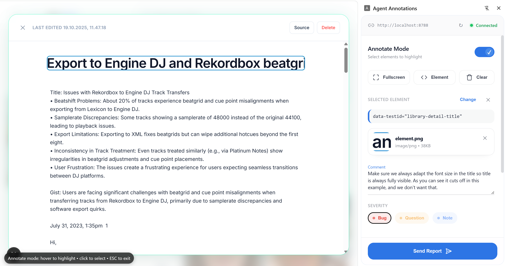
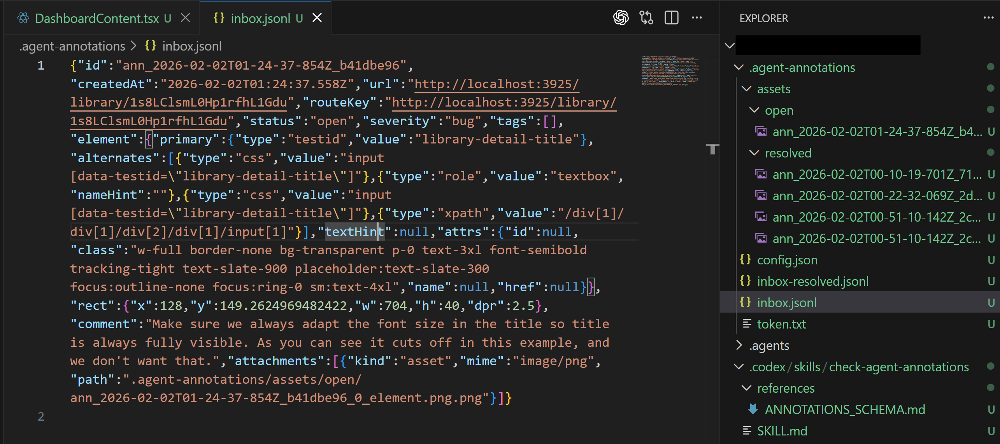
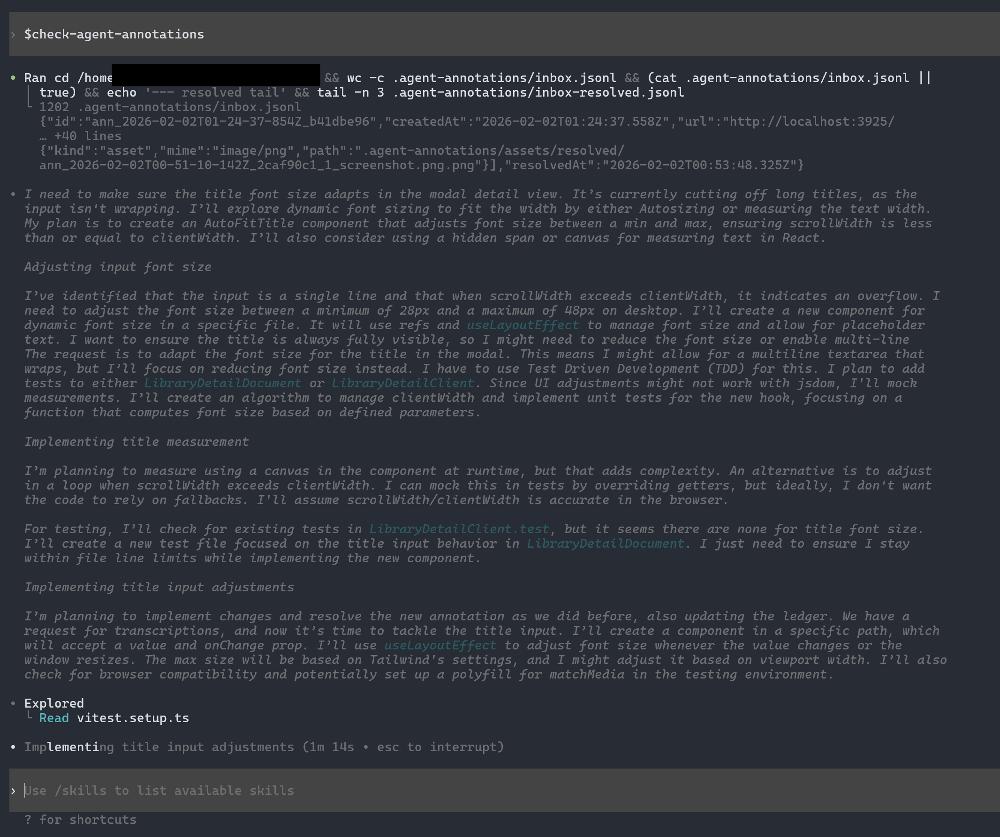

# Agent Annotations

A Chrome side-panel extension for annotating UI elements on pages (often `localhost`), plus a lightweight local receiver that writes an agent-friendly inbox into your repo.

## How it works (visual)

1) Annotate an element in the extension and click **Save Annotation**:



2) The receiver writes an agent-friendly inbox into your repo (`.agent-annotations/`):



3) In your agent, run `check-agent-annotations` to turn annotations into actions:



## Quick start

### First time (per repo)

1. Install the extension:
   - Download the zip from [GitHub Releases](https://github.com/ossianravn/agent-annotations/releases/latest)
   - Unzip it (so the folder contains `manifest.json` at the top level)
   - In `chrome://extensions` (Developer mode), **drag the folder in** (or click **Load unpacked** and select it)
2. In the repo you want to write annotations into, run (and keep it running):
   ```bash
   pnpm dlx agent-annotations setup
   ```
   If you’re using a specific agent, set it explicitly (example: `--agent claude`).
3. Paste the token into the extension’s connection settings (it’s also saved to `.agent-annotations/token.txt`)
4. In your agent, invoke: `check-agent-annotations`

### Daily use

1. From the repo root, start the receiver (and keep it running):
   ```bash
   pnpm dlx agent-annotations start --port 8787
   ```
2. Open the extension (it should already have your token; if not, use `.agent-annotations/token.txt`)
3. In your agent, invoke: `check-agent-annotations`

Saved unresolved annotations remain available in the side panel. Open one to
edit its comment, copy it as a prompt, preview image attachments, or resolve it.
Image attachments appear as square thumbnails; selecting one opens the full
image with its stored path below it.

What `setup` does:
- Installs the skill/instructions into the repo (so your agent will read `.agent-annotations/`)
- Installs `.tools/agent-annotations-receiver.cjs` and starts the receiver (writes `.agent-annotations/` into the repo)

---

This kit includes:
- **Chrome extension** (load unpacked)
- **Repo integration** (`.tools` receiver launcher + example snippets)
- **Published npm packages**:
  - `agent-annotations-receiver` (CLI receiver)
  - `agent-annotations` (init scaffold for repos)

---

## 1) Install the extension (Chrome/Chromium: Windows/macOS/Linux)

Requires a Chromium browser with the Extensions Side Panel API (Chrome/Edge/Brave, etc.).

### Option A: Download the extension zip (recommended)

1. Download the latest release asset from [GitHub Releases](https://github.com/ossianravn/agent-annotations/releases/latest)
2. Unzip it into its own folder (so the folder contains `manifest.json` at the top level)
3. Open `chrome://extensions`
4. Enable **Developer mode**
5. Drag the folder into the page (or click **Load unpacked** and select it)

### Option B: Load unpacked from this repo

1. Open `chrome://extensions`
2. Enable **Developer mode**
3. Click **Load unpacked**
4. Select: `chrome-extension/`

Click the extension icon → the side panel opens.

Shortcut to toggle annotation mode:
- Windows/Linux: `Ctrl+Shift+Y`
- macOS: `Command+Shift+Y`

---

## 2) Run the receiver

### Option A: one command (recommended)
From the repo root you want to write `.agent-annotations/` into (keeps running):
```bash
pnpm dlx agent-annotations setup
```

### Option B: start again later
After you’ve run `setup` once, you can start the receiver again with:
```bash
pnpm dlx agent-annotations start --port 8787
```

### Option C: receiver only (advanced / debugging)
If you only want the receiver (no skill/instructions install), run:
```bash
pnpm dlx agent-annotations-receiver --port 8787
```

On first run it:
- prints a token
- writes `.agent-annotations/token.txt`
- writes `.agent-annotations/config.json` with the receiver base URL

Paste the token into the extension’s connection settings.

---

## 3) Install into a repo (init scaffold)

This installs repo integration + skill/instructions, but does not start the receiver:

```bash
pnpm dlx agent-annotations init
```

### Options
- `--agent auto|codex|claude|gemini|antigravity|opencode|copilot|all`
  - `auto` detects common agent config folders and falls back to `codex`
- `--skill repo|user|none` (default: `repo`)
- `--receiver repo|none` (default: `repo`)
- `--force` overwrite existing files

### Examples

Install Codex skill into the repo:
```bash
pnpm dlx agent-annotations init --agent codex --skill repo
```

Install Claude Code skill globally:
```bash
pnpm dlx agent-annotations init --agent claude --skill user
```

Skip adding receiver files (you’ll run the receiver some other way):
```bash
pnpm dlx agent-annotations init --receiver none
```

Install everything (useful for open-source repos that want to support multiple agents):
```bash
pnpm dlx agent-annotations init --agent all --skill repo
```

Copilot note:
- Copilot does not use `SKILL.md`. The scaffold will create/update:
  - `.github/copilot-instructions.md`

---

## 4) Where data goes

Open (active):
- `.agent-annotations/inbox.jsonl`
- `.agent-annotations/assets/open/`

Resolved (archive):
- `.agent-annotations/inbox-resolved.jsonl`
- `.agent-annotations/assets/resolved/`

---

## 5) Using it with agents

### Skills-based agents (Codex, Claude Code, Gemini CLI, Antigravity, OpenCode)
If you installed the skill, invoke it by name: `check-agent-annotations`.

Examples:
- **Codex**: `$check-agent-annotations`
- **Claude Code**: `/check-agent-annotations`

### Any agent (manual)
Agents can simply read `.agent-annotations/inbox.jsonl` and act on it.

Browser validation should only happen if the **user explicitly asks**, and only using tools available in that agent environment (browser skill, MCP tool, Playwright, etc.).

---

## Repo hygiene

- `.tools/` is intentionally a **process tool** folder.
- In most repos you’ll want to ignore `.agent-annotations/`; copy `.gitignore.snippet` into your repo’s `.gitignore`.

---

## Maintainers: releasing

1. Bump versions to `X.Y.Z` in:
   - `chrome-extension/manifest.json`
   - `packages/agent-annotations/package.json`
   - `packages/agent-annotations-receiver/package.json`
2. Commit the version bump.
3. Tag and push:
   ```bash
   git tag vX.Y.Z
   git push origin vX.Y.Z
   ```

This triggers GitHub Actions to:
- build and attach the extension zip to a GitHub Release
- publish `agent-annotations` and `agent-annotations-receiver` to npm (via npm Trusted Publishers)
